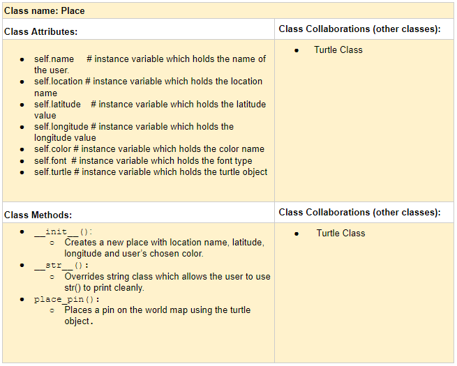

# P01: World at Your Fingertips

**Author**: Hila Manalai

**Date**: 04/30/2019

**Slides**: https://github.com/spring-2019-csc-226/p01-final-project-hmanalai/blob/master/World%20at%20your%20fingertips.pdf

---

## Design Plan

**CRC card for the Place class used in this program.**
  
   

### User Instructions
My program is designed to place a pin on any location chosen on a map. 
In order to use it, follow the following steps.
* Run the program 
* A question will pop up on the console asking you to choose a world. You can do this by typing in the name of the world. For either choice the corresponding map will be displayed on the screen. 
* Choose a place on the map by clicking on that specific location.
* After clicking on the location, you will be prompted to answer five questions. The questions will be displayed on the console. 
* After all the questions have been answered, a pin will be placed where you clicked along with all the information you had provided.
* You can close the program by pressing the Key q 
* You can also clear the map by pressing the Key r

### Demo 

* 

* 

### Errors
My program has one limitation. If user does not specify the correct color name, then the program will give an error and it will not display user's input on the map. 

### Reflection
I chose this project because I like traveling. Before coming to the US, in my spare time, I used to pull up google map and go to different places and imagine traveling there. This project associated with that hobby of mine and I thought I would enjoy creating a program that allows you to place pins in all the places you want to go to.

The most challengin part of the whole project was figuring out how to make a Place class. It was a challenge because I had to transition from thinking in a procedural programming to object-oriented programming. The concept was new, therefore, for me, creating the Place class was both learning and applying at the same time. 

There are several things I learned from the final project. First off, from creating the CRC card I learned about the importance of having a design before coding. With the CRC card I made the blueprint for my class, which was the hardest part of the project, and then I turned the ideas jotted down in the CRC to reality when I coded. That way I had little debugging to do. And I am sure I would have had to do a lot more debugging if I had not done the planning beforehand. Moreover, it was very satisfying to apply all the skills that I have learned throughout the semester and realize how far I have come. I also learned how to use classes and now I feel comfortable using them and I have comprehended its usage and usefulness. 

Seeing how classes can be efficient in coding, next time I will implement more classes. 
And one of the things I did not like in my program was that the user had to go back to the console. To make the program more user friendly next time I code, I will make use of other python libraries.

### References
* The original code of T10 assignment written by Dr. Scott Heggen and Dr. Jan Pearce: I used all of the original code and refactored it.
* Stack Overflow: I used the code from the following link for adding sound. (https://stackoverflow.com/questions/307305/play-a-sound-with-python)
* Professor Lovell: Hepled me debug, especially in the early stages of coding, when I was trying to make a Place class. 
